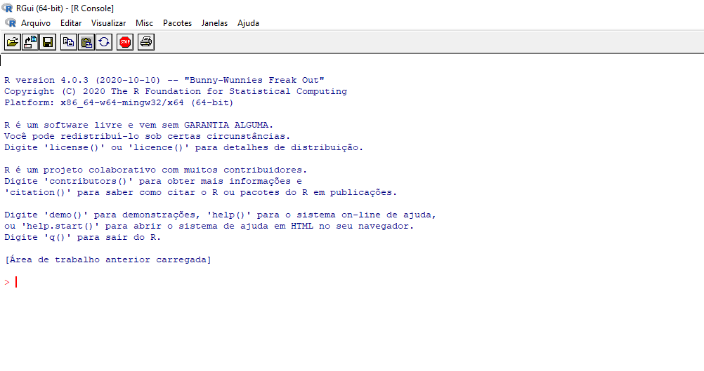
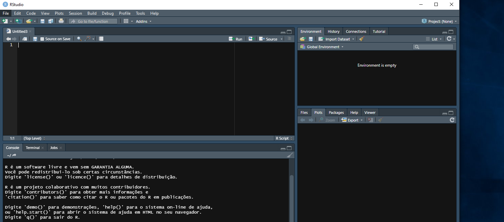
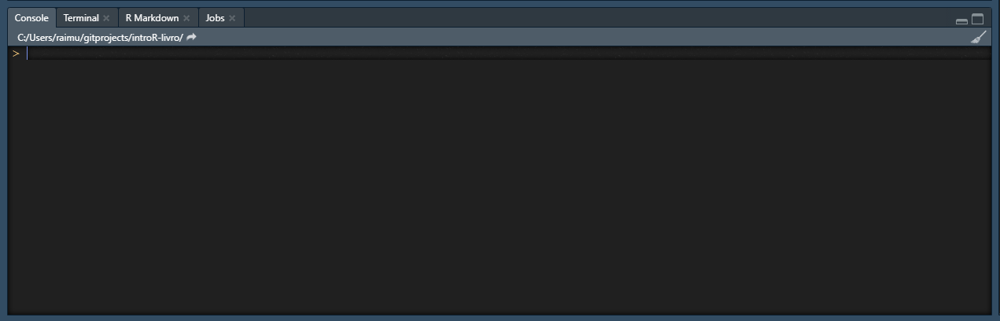
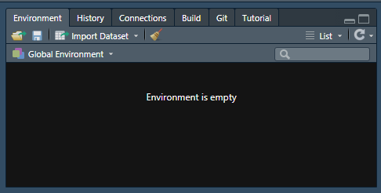
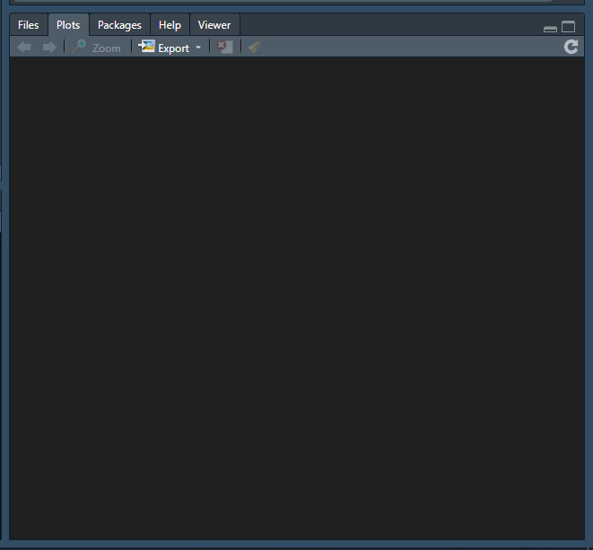

# O que é o R? {#intro}

R é uma linguagem de programação muito utilizada para o desenvolvimento de estatísticas e cálculos matemáticos. Entretanto, enquanto linguagem de programação, ela possui muitos usos, como a raspagem de sites, a automatização de download de arquivos, e a produção de dashboards e relatórios, sendo útil para a coleta de dados e para o reporte das análises, além de ser gratuita.

Mas o que significa ser uma linguagem de programação? Basicamente, você irá dar ordens ao computador por meio de comandos. A vantagem de aprender a estruturar os comandos (ao invés de usar um programa estatístico já consolidado, como o Stata) é que você pode customizar a vontade suas análises. Os programas estatísticos trazem muitas opções pré-prontas. Por exemplo, no Stata é comum que você possa clicar em uma janela e solicitar um quadro com as estatísticas descritivas (média, moda, mediana) de um banco de dados. Entretanto, qualquer funcionalidade fora do padrão oferecido por aqueles pacotes precisará ser gerada pelo próprio usuário (e quando você usa algum recurso como o ssc install é porque alguém gastou um tempinho fazendo isso).

Aliás, o Python (outra linguagem de programação) possui funcionalidades bem similares ao R, embora o modo de escrever os programas seja bem diferente. Imagine que o Português e o Espanhol têm o mesmo propósito - a comunicação - e que mesmo tendo uma mesma raiz (e inclusive diversos vocábulos bem parecidos), possuem algumas regras estruturais bem diferentes, o que inclui, por exemplo, as regras de acentuação e o som produzidos pelas letras: qual a diferença de cajá (PT-BR) para caja (ES); qual a diferença de pastel (PT-BR) para pastel (ES)?

É preferível que o analista iniciante dedique-se a uma das duas (R ou Python). Posteriormente, aprender a outra (ou mais alguma que esteja despontando no mercado, como a Julia) será uma tarefa bem mais simples. Isso se deve ao fato de que diversos elementos da programação se repetem entre as diferentes linguagens, especialmente os conceitos. Um IF tem o mesmo propósito em R ou em Python ou em Java ou em C++, embora a forma como você deve explicar ao computador o que fazer com esse IF será bem diferente em cada linguagem.
 
<!-- You can label chapter and section titles using `{#label}` after them, e.g., we can reference Chapter \@ref(intro). If you do not manually label them, there will be automatic labels anyway, e.g., Chapter \@ref(methods). -->

<!-- Figures and tables with captions will be placed in `figure` and `table` environments, respectively. -->

<!-- ```{r nice-fig, fig.cap='Here is a nice figure!', out.width='80%', fig.asp=.75, fig.align='center'} -->
<!-- par(mar = c(4, 4, .1, .1)) -->
<!-- plot(pressure, type = 'b', pch = 19) -->
<!-- ``` -->

<!-- Reference a figure by its code chunk label with the `fig:` prefix, e.g., see Figure \@ref(fig:nice-fig). Similarly, you can reference tables generated from `knitr::kable()`, e.g., see Table \@ref(tab:nice-tab). -->

<!-- ```{r nice-tab, tidy=FALSE} -->
<!-- knitr::kable( -->
<!--   head(iris, 20), caption = 'Here is a nice table!', -->
<!--   booktabs = TRUE -->
<!-- ) -->
<!-- ``` -->

<!-- You can write citations, too. For example, we are using the **bookdown** package [@R-bookdown] in this sample book, which was built on top of R Markdown and **knitr** [@xie2015]. -->


## Instalando o R

O R é instalado como um programa normal. Primeiro, você deve acessar a página do [R Project](https://cran.r-project.org/mirrors.html). Há vários links para baixar. Todos funcionam e disponibilizam os mesmos arquivos, mas sugere-se clicar no local mais próximo ao que você se encontra.

Na nova página, clique em Download R for Windows. Depois, clique em base. Caso você queira baixar a versão mais recente, clique em Download R xxx for Windows. Caso você prefira uma versão mais antiga, clique em Previous releases (fica um pouco abaixo, na seção Other Builds).

Alternativamente, [clique aqui](https://vps.fmvz.usp.br/CRAN/bin/windows/base/release.html).



Na parte superior, é possível visualizar a versão do R que está sendo executada. Nem sempre é interessante, para o programador novato, usar a última versão disponível, porque ela ainda pode conter alguns bugs. Por isso, mesmo que a versão mais atual seja a 4.0.4, pode ser interessante nos mantermos na 4.0.3 ou até mesmo na 3.6.3.

Na linha iniciada por $>$ podemos dar instruções ao R. Por exemplo, digite 1+1 e depois aperte ENTER.

```{r}
1+1
```

O R executou a soma solicitada e retornou o resultado.

## R Studio

O R Studio é um programa que permite trabalhar o R de forma aprimorada. Ele é o que os desenvolvedores chamada de Ambiente Integrado de Desenvolvimento (ou Integrated Development Environment (IDE), no original). Já tendo instalado o R, que fornece a base da linguagem de programação e a interface básica com o computador, podemos agora instalar o R Studio. 

Primeiramente acesse o site do [R Studio](https://www.rstudio.com/products/rstudio/download/#download). Embora existam versões pagas com recursos interessantes, todos os recursos necessários ao programador iniciante estão incluídos na versão gratuita. Clique no botão DOWNLOAD R STUDIO FOR WINDOWS. Depois do download concluído, instale o programa na sua máquina normalmente. O R Studio automaticamente identifica o R-base instalado na sua máquina (é realmente necessário já ter instalado o R antes!).



O RStudio tem quatro áreas relevantes. Na parte superior esquerda, ficam os scripts; na parte inferior esquerda, o console; na parte superior direita, o ambiente; no parte inferior direita, os diretórios, gráficos, pacotes, e a ajuda.

O script é um arquivo com um roteiro. Você não é obrigado a usar um script, mas é muito útil usá-lo, porque pode ser interessante que você retome o trabalho posteriormente. Você começa a preparar um roteiro em um dia e, posteriormente, continua a escrevê-lo, ou a ajustá-lo. Nesses roteiros, há linhas de código (comandos que o R executará) e linhas de comentários (texto que o R deve ignorar, mas que é muito útil para os humanos que estão lendo o script). Os comentários podem servir para dividir o roteiro em seções, informando que as linhas de código seguintes tem tal utilidade; ou para lembrar o próprio programador de algo, como o que ele ainda precisa fazer ou que tipo de informação aquele código irá produzir.

> É uma boa prática de programação incluir comentários no código. 
> Lembre-se que se você precisar ver novamente seu código depois de um tempo, você pode não lembrar bem de várias coisas que você tinha em mente quando o estava escrevendo.
> Por exemplo, se você está escrevendo um código para uma disciplina de um curso, pode ser que você precise meses depois desse mesmo código. Será que você lembrará de tudo o que é necessário?

No Console, você pode passar informações para o R que não foram incorporadas ao Script. ÀS vezes você quer ficar testando algum procedimento, até encontrar a solução correta para um problema, podendo ser útil fazer isso direto no Console, para depois incluí-la no Script.



Na linha iniciada por um > podemos digitar comandos. Uma das principais vantagens do R Studio é que facilita o acompanhamento das informações que estão sendo trabalhadas. Essa IDE exibe, no painel lateral, os bancos de dados que estão ativos, as variáveis que foram salvas e as funções criadas pelo próprio usuário.



Como o programa acabou de ser aberto pela primeira vez, ainda não tem nada na memória. Entretanto, se você digitar no Console 

> mensagem = "Olá Mundo"

E pressionar ENTER no teclado, aparecerá no "Environment" a informação de que há uma "mensagem" cujo conteúdo é "Olá Mundo". Essa informação pode ser tratada posteriormente. Por enquanto, digite:

> x = 1

E agora perceba que há um "x" que contém o valor "1". É possível modificar o conteúdo desse x.

> x = x + 1

Estamos pedindo que o R some ao X o número 1; em outras palavras, o x agora é igual ao que já havia no próprio x mais 1. Obviamente, o resultado é 2. No environment é possível checar isso. Para ver isso no Console, digite apenas 

> x

E o console exibirá o conteúdo desse x, o número 2.



## R nas Nuvens

O R Studio Cloud permite que você use o R Studio sem precisar instalá-lo na sua máquina. Para o usuário iniciante com uma conta gratuita, a principal limitação é a do tempo de uso, que é de 25 horas mensais. Por isso, essa pode ser uma opção circunstancialmente viável (você pode estar em um computador diferente do que você habitualmente utiliza), mas normalmente é recomendável que você instale os programas no seu computador e rode localmente os códigos.

De toda forma, é sempre útil conhecer essa opção, criando uma conta gratuita em [https://rstudio.cloud/](https://rstudio.cloud/). 

## Scripts

Algumas informações adicionais sobre os scripts. O arquivo de script funciona como um roteiro e deve conter dois tipos de informações: linhas de código e linhas de comentário. 

As linhas de código são aquelas que o R irá ler, interpretar e executar; ou seja, produzirão algum efeito. Pode-se usar linhas de código para gravar informações na memória do sistema, trazendo os dados contidos em um arquivo ou declarando o conteúdo de uma variável (*x = 1* significa que há uma variável *x* cujo conteúdo é o número *1*). Também são usadas para transformar o que está contido na memória, e para gerar saídas, como a criação de arquivos cujo conteúdo são os objetos que estão armazenados na memória (depois que você "importou" para o R os dados das vendas, você produziu os relatórios, transformando os dados em informação útil e por fim disponibilizou essa informação em algum modo mais acessível a pessoas que não usam o R, como um .pdf)

As linhas de comentário são utilizadas para descrever o código, sem que isso represente um detalhamento. A ideia é que haja informações que ajudem a esclarecer o que está acontecendo. Se seu script possui apenas duas linhas de código, você pode incluir apenas uma linha de comentário informando o objetivo daquela rotina. Entretanto, conforme o script vai crescendo e atinge algumas centenas ou milhares de linhas de código torna-se imprescindível que haja mais linhas de comentário. Elas ajudam a separar as funcionalidades (esse primeiro bloco é usado para a importação de dados; o segundo, para ver se os dados estão corretos; o terceiro, para o tratamento; e assim por diante...); a indicar que tipos de dados são esperados nas funções; que tipo de saída será produzida; o que aquele pedaço de código realmente faz. As linhas de comentário devem começar com um # (jogo da velha ou cerquilha). Essas linhas são "ignoradas", não surtindo efeito sobre o que está sendo desenvolvido.

```{r}
# Essa é uma linha de comentário
1+1 # os comentários também podem vir imediatamente após o código
```

Às vezes, temos a intenção de fazer com que um bloco (conjunto) de linhas de código seja ignorado. Isso geralmente acontece quando estamos escrevendo um programa e queremos testar diferentes possibilidades. Uma forma simples de fazer isso sem apagar aquele bloco é deixando-o "comentado", ou seja, fazendo com que todas as suas linhas sejam iniciadas por um #. No R Studio, isso pode ser feito convenientemente: selecione o bloco que você pretende deixar "comentado" e aperte Ctrl + Shift + C. Se você usa um sistema operacional diferente do Windows, a tecla de atalho pode ser outra.

```{r}
# Essa é uma linha de comentário
#1+1 # essa linha não será executada
2+2 # apenas essa linha produzirá efeito
```

## Exercício

Copie o seguinte texto pro Script do R Studio.

```{r eval = FALSE}

meu_primeiro_objeto = "Hello World"
# Há uma tradição entre programadores de que você deve incluir na primeira lição
# sobre uma linguagem de programação o print do Hello World. Esse comando faz com que 
# Seja exibida a mensagem "Hello World" (Olá Mundo). Não fazer isso dá azar.
print(meu_primeiro_objeto)

taxa = 0.05
valor_presente = 1000
tempo = 10
valor_futuro = valor_presente*(1+taxa)^tempo
mensagem = paste("O valor futuro do empréstimo é", valor_futuro)

print(mensagem)
```

- Selecione a primeira linha e clique em Run. O que aconteceu com o Global Environment e com o Console?
- Selecione a segunda linha e clique em Run. O que aconteceu com o Global Environment e com o Console?
- Clique no botão Source. O que aconteceu com o Global Environment e com o Console?

## Gabarito Exercício

> Selecione a primeira linha e clique em Run. O que aconteceu com o Global Environment e com o Console? O R cria um objeto contendo "Hello World" e temporariamente o grava na memória. Esse objeto aparece no Global Environment. No Console, aparece o comando que foi dado.

> Selecione a segunda linha e clique em Run. O que aconteceu com o Global Environment e com o Console? A segunda linha é iniciada por um #, o que significa que é uma linha de comentário. O R irá levá-la para o Console, mas não a executará (justamente porque é um comentário). Então irá tentar executar a terceira linha. Como também é um comentário, será registrada no Console, mas sem qualquer efeito. O mesmo vale para a quarta linha. A quinta linha contém código, solicitando que o comando print(meu_primeiro_objeto) seja executado. Esse comando será registrado no Console; o R irá ler o conteúdo do objeto meu_primeiro_objeto e exibirá seu conteúdo: "Hello World".

> Clique no botão Source. O que aconteceu com o Global Environment e com o Console? Todo o script é lido; e todas as linhas de código, executadas. São temporariamente armazenados na memória, além do meu_primeiro_objeto, a taxa, o tempo, o valor_presente, o valor_futuro (no caso, o resultado do cálculo proposto) e a mensagem. NO console aparecem todas as linhas lidas e é exibido o conteúdo do objeto mensagem: "O valor futuro do empréstimo é 1628.89462677744".
